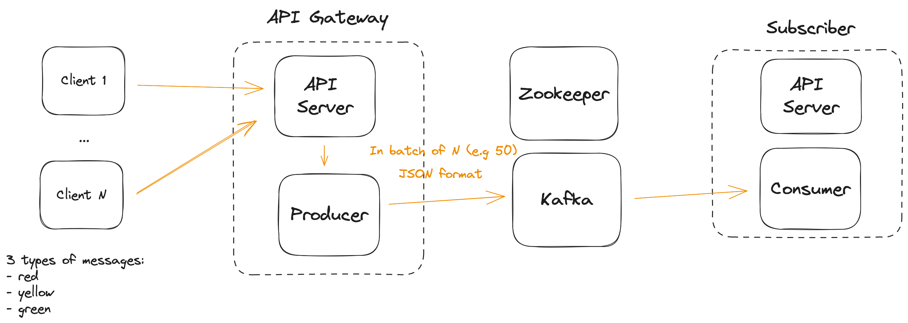

# Golang + Kafka

## Objective

The project is inspired by The Primeagen's article review - [From $erverless to Elixir](https://www.youtube.com/watch?v=UGG2HMonQ1c). The reviewed article is [here](https://medium.com/coryodaniel/from-erverless-to-elixir-48752db4d7bc). The article was describing how the company had a big bill using API Gateway and Lambda serverless solution. They decided to migrate to Elixir on Kubernetes and it turned out to be a good solution for them.

This project is a very simplified version where I want to build a Golang server that can accept many incoming HTTP requests, batch them, and send them to Kafka. On the other side, a Golang subscriber will read the messages and can do anything with them (e.g., send some notifications). What subscriber does with messages is not of interest for now.

I want to start with the least optimal solution (e.g., sending each message from HTTP request separately to Kafka) and then step-by-step add improvements to increase the thought of the system and decrease memory usage (e.g., batch message, using ring buffers).



## Resources

The list of resource and tools used to build the project:

- [kcat](https://github.com/edenhill/kcat), CLI to query Kafka;
- [wrk](https://github.com/wg/wrk), for load testing;
- [Tutorial used to setup Kafka locally via Docker Compose](https://hackernoon.com/setting-up-kafka-on-docker-for-local-development).

## Development and testing

### Benchmarking

1. Start Docker Compose:

```bash
docker-compose up -d
```

2. Run `benchmark.sh` script from `scripts/`:

```bash
./benchmark.sh
```

### CURL

For convenience, here is a CURL command to send a JSON payload to the server:

For API gateway:

```
curl -X POST -H "Content-Type: application/json" \
    -d '{"type": "red", "client_id": 1}' \
    http://localhost:8080/metrics
```

For consumer:

```
curl -X GET http://localhost:8080/statistics
```
